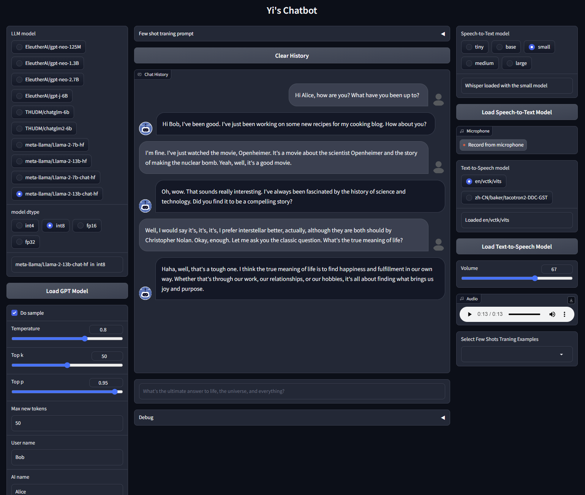

# Yi's Chatbot

A chatbot demo that allows speech-to-speech or text based chat experience with the LLM. Local deployment. No APIs used.



## Environment

Create a virtual environment, I used conda here

```bash
conda create -n chatbot python=3.10
```

Activate the virtual environment

```bash
conda activate chatbot
```

Install PyTorch

```bash
conda install pytorch torchvision torchaudio pytorch-cuda=11.7 -c pytorch -c nvidia
```

Install ffmpeg if your pytorch does not come with ffmpeg

```bash
conda install ffmpeg -c pytorch
```

Install other dependencies

```bash
pip install gradio transformers TTS openai-whisper opencc
```

Now, it's sufficient for the chatbot to run with GPT-J and GPT-neo family.

(Optional) Dev tools

```bash
pip install jupyter
```

(Optional) Allow loading models in ```int8```, ```int4```.

```bash
pip install bitsandbytes accelerate
```

(Optional) Add support for ChatGLM2-6B

```bash
pip install transformers==4.30.2 cpm_kernels mdtex2html sentencepiece accelerate
```

(Optional) Add support for Llama2. 

Llama2 is a private repository. You need to apply for access in advance, and associate the privilege with your HuggingFace account. Then login to gain access:

```bash
huggingface-cli login
```

### Note

-   In WSL, I also need to symlink ```libcuda.so``` to the environment library. Otherwise it seems ```bitsandbytes``` could not find it.

    Example:

    ```bash
    ln -s /usr/lib/wsl/lib/libcuda.so /home/USERNAME/miniconda3/envs/chatbot/lib/libcuda.so
    ```

## Launch the Demo

```bash
python demo/launch.py
```

Then open `https://localhost:7860` in the browser, or the link provided after the server fully started.

## To-Do

-   Replace `whisper` with `whisperX` to speed up speech recognition.

-   Instead of coquiTTS, try Bert-VITS2 or tortoiseTTS. Bert-VITS2 has by far the best quality but it's also hard to implement as it's still in the early stage.